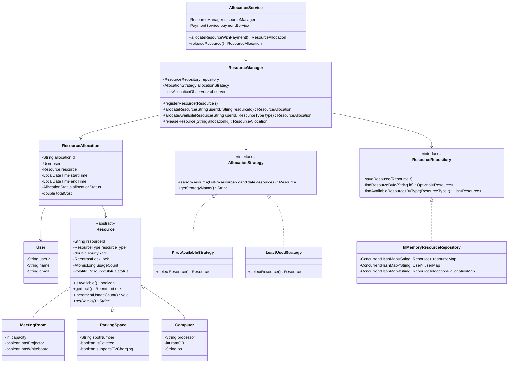

# Thread-Safe Resource Management System (Low-Level Design - Java)

A high-performance, interview-oriented **Low-Level Design (LLD)** implementation of a **Thread-Safe Resource Management System** built in **Java 21**.

This project manages shared physical and digital resources (Meeting Rooms, Parking Spaces, Computers, Workstations, Charging Stations) in a multi-user environment while guaranteeing **thread safety**, **zero race conditions**, **high concurrency throughput**, and adherence to **SOLID principles** and **Software Design Patterns**.

---

## Table of Contents
1. [Problem Statement](#problem-statement)
2. [Key Features](#key-features)
3. [System Architecture & Class Diagram](#system-architecture--class-diagram)
4. [Low-Level Design & SOLID Principles](#low-level-design--solid-principles)
5. [Design Patterns Implemented](#design-patterns-implemented)
6. [Concurrency & Race-Condition Prevention](#concurrency--race-condition-prevention)
7. [Resource Allocation Strategies](#resource-allocation-strategies)
8. [Time & Space Complexity Analysis](#time--space-complexity-analysis)
9. [Project Directory Structure](#project-directory-structure)
10. [How to Build and Run](#how-to-build-and-run)
11. [Sample CLI Execution & Stress Test Output](#sample-cli-execution--stress-test-output)
12. [Interview Discussion Points & Scaling Strategy](#interview-discussion-points--scaling-strategy)

---

## Problem Statement

In concurrent systems, multiple clients or worker threads frequently request access to limited shared resources simultaneously. Standard non-synchronized operations suffer from critical race conditions such as **Double Allocation**:

```text
User A → requests Resource R1 (reads AVAILABLE) ──┐
                                                  ├─► Both acquire R1! (Data Inconsistency)
User B → requests Resource R1 (reads AVAILABLE) ──┘
```

### Goal
Design a generic, extensible, and thread-safe resource manager that guarantees:
- **Thread Safety**: Exactly one thread can successfully acquire a specific resource at any given moment.
- **Fine-Grained Locking**: Allocating Resource R1 does not block allocations of Resource R2.
- **Dynamic Allocation Policies**: Strategies can be swapped at runtime (e.g., First Available vs. Least Used load balancing).
- **Extensible Domain Model**: Seamless support for diverse resource types (Meeting Rooms, Parking Spots, Computers, EV Chargers, Workstations) and optional payment/billing integrations.

---

## Key Features

- **Fine-Grained Instance Synchronization**: Uses individual `ReentrantLock` instances per `Resource` object to maximize concurrent throughput.
- **Pluggable Allocation Strategies**: Uses the **Strategy Pattern** for `FirstAvailableStrategy`, `LeastUsedStrategy` (wear-and-tear load balancing), and `RandomAvailableStrategy`.
- **Thread-Safe Repository Abstraction**: Built on `ConcurrentHashMap` with clean decoupling between business logic and storage interfaces.
- **Audit & Observer System**: Real-time event notifications via `AllocationObserver` for tracking allocations, releases, and metrics.
- **Extensible Payment Subsystem**: Supports `HourlyRatePaymentStrategy` and `FreePaymentStrategy`.
- **Interactive CLI & Automated Concurrency Suite**: Live CLI menu featuring a 10-thread parallel stress test and 9 comprehensive JUnit 5 tests.

---

## System Architecture & Class Diagram

### Mermaid Class Diagram



---

## Low-Level Design & SOLID Principles

1. **Single Responsibility Principle (SRP)**:
   - `ResourceRepository`: Exclusively handles storage & retrieval.
   - `AllocationStrategy`: Purely decides selection criteria for resources.
   - `ResourceManager`: Controls resource lifecycle and status transitions.
   - `PaymentService`: Encapsulates billing transactions.

2. **Open/Closed Principle (OCP)**:
   - Adding a new `Resource` type (e.g., `DroneStation`) requires creating a new subclass of `Resource` without modifying existing allocation logic.
   - Adding a new selection strategy (e.g., `HighestCapacityStrategy`) requires implementing `AllocationStrategy` without altering `ResourceManager`.

3. **Liskov Substitution Principle (LSP)**:
   - All subclasses (`MeetingRoom`, `Computer`, `ParkingSpace`) adhere strictly to the contracts of `Resource` and can be passed seamlessly to allocation logic.

4. **Interface Segregation Principle (ISP)**:
   - Specialized, lean interfaces (`AllocationStrategy`, `PaymentStrategy`, `AllocationObserver`, `ResourceRepository`) ensure clients depend only on methods they consume.

5. **Dependency Inversion Principle (DIP)**:
   - High-level modules (`AllocationService`, `ResourceManager`) depend on abstractions (`ResourceRepository`, `AllocationStrategy`, `PaymentStrategy`), not concrete implementations.

---

## Design Patterns Implemented

| Pattern | Class / Component | Purpose |
| :--- | :--- | :--- |
| **Strategy Pattern** | `AllocationStrategy` (`FirstAvailableStrategy`, `LeastUsedStrategy`) | Encapsulates resource selection algorithms and allows dynamic runtime policy switching. |
| **Factory Pattern** | `ResourceFactory` | Centralizes object creation for concrete resource types (`MeetingRoom`, `Computer`, etc.). |
| **Observer Pattern** | `AllocationObserver`, `AuditLoggerObserver` | Decouples compliance logging and real-time event broadcasting from core business logic. |
| **Facade Pattern** | `AllocationService` | Provides a unified entry point simplifying complex multi-step workflows (User lookup + Payment + Resource Allocation). |
| **Repository Pattern** | `ResourceRepository` | Abstracts data access mechanisms away from service layers. |

---

## Concurrency & Race-Condition Prevention

### Why Race Conditions Occur
Without explicit synchronization, two threads executing `allocateResource("R1")` concurrently will both evaluate `resource.getStatus() == AVAILABLE` as `true` and subsequently mark `R1` as `ALLOCATED`.

### Selected Concurrency Mechanisms & Rationale

1. **Fine-Grained Instance Locking (`ReentrantLock`)**:
   - *Selection*: Each `Resource` instance owns its own fair `ReentrantLock` (`new ReentrantLock(true)`).
   - *Rationale*: Avoids coarse-grained global locks on `ResourceManager`. Threads allocating different resources proceed in parallel without thread contention. Fair locking prevents thread starvation.

2. **Double-Checked Locking Pattern**:
   - *Selection*: When a thread acquires `resource.getLock().lock()`, it immediately re-validates `if (!resource.isAvailable())`.
   - *Rationale*: Protects against state changes that occurred between strategy evaluation and lock acquisition.

3. **Thread-Safe Data Structures (`ConcurrentHashMap`)**:
   - *Selection*: `InMemoryResourceRepository` uses `ConcurrentHashMap` for stored maps.
   - *Rationale*: Provides lock-free concurrent reads (`O(1)`) and bucket-level lock stripping for safe concurrent updates.

4. **Atomic Variables (`AtomicLong`, `AtomicInteger`)**:
   - *Selection*: `usageCount` in `Resource` uses `AtomicLong`; `allocationIdSequence` uses `AtomicLong`.
   - *Rationale*: Lock-free, hardware-level CAS (Compare-And-Swap) operations for thread-safe counters.

5. **Volatile Memory Visibility (`volatile`)**:
   - *Selection*: `status` field in `Resource` and `allocationStrategy` in `ResourceManager` are declared `volatile`.
   - *Rationale*: Ensures CPU cache coherency and immediate visibility of updates across threads.

---

## Resource Allocation Strategies

1. **`FirstAvailableStrategy`**:
   - Returns the first available resource matching requested criteria.
   - Time Complexity: `O(1)` average, `O(K)` worst-case (where `K` is number of resources of type `T`).

2. **`LeastUsedStrategy`**:
   - Evaluates candidate resources and selects the resource with the lowest `usageCount`.
   - Promotes **wear-and-tear load balancing** across equipment (computers, chargers, workstations).
   - Time Complexity: `O(K)` linear scan over available resources.

3. **`RandomAvailableStrategy`**:
   - Randomly selects an available resource using `ThreadLocalRandom`.

---

## Time & Space Complexity Analysis

| Operation | Method | Time Complexity | Space Complexity |
| :--- | :--- | :--- | :--- |
| **Register Resource** | `registerResource(Resource)` | `O(1)` | `O(1)` |
| **Get Resource Status**| `getResourceStatus(id)` | `O(1)` | `O(1)` |
| **Allocate by Specific ID**| `allocateResource(userId, resourceId)` | `O(1)` | `O(1)` |
| **Auto-Allocate (First Available)**| `allocateAvailableResource(userId, type)` | `O(K)` | `O(K)` candidate snapshot |
| **Auto-Allocate (Least Used)**| `allocateAvailableResource(userId, type)` | `O(K)` | `O(K)` candidate snapshot |
| **Release Resource** | `releaseResource(allocationId)` | `O(1)` | `O(1)` |

*Where `N` is total system resources, and `K` is number of resources matching a specific `ResourceType` (`K <= N`).*

---

## Project Directory Structure

```text
thread-safe-resource-manager/
 ├── pom.xml
 ├── README.md
 └── src/
      ├── main/
      │    └── java/
      │         └── com/resourcemanager/
      │              ├── Main.java                          # CLI Application & Live Stress Test Runner
      │              ├── exception/                         # Custom System Exceptions
      │              │    ├── InvalidAllocationException.java
      │              │    ├── PaymentFailedException.java
      │              │    ├── ResourceNotFoundException.java
      │              │    ├── ResourceUnavailableException.java
      │              │    └── UserNotFoundException.java
      │              ├── factory/                           # Factory Design Pattern
      │              │    └── ResourceFactory.java
      │              ├── model/                             # Domain Entities & Enums
      │              │    ├── AllocationStatus.java
      │              │    ├── Resource.java
      │              │    ├── ResourceAllocation.java
      │              │    ├── ResourceStatus.java
      │              │    ├── ResourceType.java
      │              │    ├── User.java
      │              │    └── resources/                    # Concrete Resource Types
      │              │         ├── ChargingStation.java
      │              │         ├── Computer.java
      │              │         ├── MeetingRoom.java
      │              │         ├── ParkingSpace.java
      │              │         └── Workstation.java
      │              ├── observer/                          # Observer Design Pattern
      │              │    ├── AllocationObserver.java
      │              │    └── AuditLoggerObserver.java
      │              ├── payment/                           # Extensible Payment Strategies
      │              │    ├── FreePaymentStrategy.java
      │              │    ├── HourlyRatePaymentStrategy.java
      │              │    └── PaymentStrategy.java
      │              ├── repository/                        # Repository Pattern (Thread-Safe)
      │              │    ├── InMemoryResourceRepository.java
      │              │    └── ResourceRepository.java
      │              ├── service/                           # Core Business Services
      │              │    ├── AllocationService.java
      │              │    ├── PaymentService.java
      │              │    └── ResourceManager.java
      │              └── strategy/                          # Strategy Design Pattern
      │                   ├── AllocationStrategy.java
      │                   ├── FirstAvailableStrategy.java
      │                   ├── LeastUsedStrategy.java
      │                   └── RandomAvailableStrategy.java
      └── test/
           └── java/
                └── com/resourcemanager/
                     └── ResourceManagerTest.java           # Comprehensive Unit & Concurrency Tests
```

---

## How to Build and Run

### Prerequisites
- **Java Development Kit (JDK 21+)**
- **Apache Maven 3.8+**

### 1. Compile the Project & Run All Tests
```bash
mvn clean test
```
*Output:*
```text
[INFO] Running com.resourcemanager.ResourceManagerTest
[INFO] Tests run: 9, Failures: 0, Errors: 0, Skipped: 0, Time elapsed: 0.326 s
[INFO] BUILD SUCCESS
```

### 2. Launch the Interactive CLI & Stress Test
```bash
mvn exec:java
```

---

## Sample CLI Execution & Stress Test Output

### Option 8: Multithreaded Concurrency Stress Test Log
```text
================================================================
  STARTING MULTITHREADED CONCURRENCY STRESS TEST                
  Scenario: 10 Parallel Threads Requesting SAME Resource (MR-201)
================================================================
Thread-1 ready and waiting at barrier...
Thread-2 ready and waiting at barrier...
Thread-3 ready and waiting at barrier...
Thread-4 ready and waiting at barrier...
Thread-5 ready and waiting at barrier...
Thread-6 ready and waiting at barrier...
Thread-7 ready and waiting at barrier...
Thread-8 ready and waiting at barrier...
Thread-9 ready and waiting at barrier...
Thread-10 ready and waiting at barrier...

>>> [SUCCESS] Thread-3 ACQUIRED lock and allocated MR-201!
[AUDIT LOG] ALLOCATED - AllocationID: ALLOC-1001 | User: U101 | Resource: MR-201
--- [EXPECTED REJECTION] Thread-1 received: Resource MR-201 is not available. Current status: ALLOCATED
--- [EXPECTED REJECTION] Thread-2 received: Resource MR-201 is not available. Current status: ALLOCATED
--- [EXPECTED REJECTION] Thread-4 received: Resource MR-201 is not available. Current status: ALLOCATED
--- [EXPECTED REJECTION] Thread-5 received: Resource MR-201 is not available. Current status: ALLOCATED
--- [EXPECTED REJECTION] Thread-6 received: Resource MR-201 is not available. Current status: ALLOCATED
--- [EXPECTED REJECTION] Thread-7 received: Resource MR-201 is not available. Current status: ALLOCATED
--- [EXPECTED REJECTION] Thread-8 received: Resource MR-201 is not available. Current status: ALLOCATED
--- [EXPECTED REJECTION] Thread-9 received: Resource MR-201 is not available. Current status: ALLOCATED
--- [EXPECTED REJECTION] Thread-10 received: Resource MR-201 is not available. Current status: ALLOCATED

------------------- CONCURRENCY TEST RESULTS -------------------
Total Competing Threads : 10
Successful Allocations  : 1 (MUST BE EXACTLY 1)
Rejected Requests       : 9 (MUST BE EXACTLY 9)
Execution Time          : 18 ms
Resource MR-201 Status  : ALLOCATED
Race Condition Check    : PASSED (THREAD SAFE)
----------------------------------------------------------------
```

---

## Interview Discussion Points & Scaling Strategy

### 1. Why `ReentrantLock` over `synchronized` block?
`ReentrantLock` supports:
- **Fairness policies** (`new ReentrantLock(true)`) to prevent thread starvation.
- **Non-blocking try-lock capabilities** (`lock.tryLock()`), allowing threads to fail fast or retry without blocking indefinitely.
- **Interruptible lock acquisition** (`lock.lockInterruptibly()`).

### 2. How to scale from Single-JVM to Distributed Microservices?
- Replace `InMemoryResourceRepository` with **PostgreSQL / MySQL** using Optimistic Locking (`@Version` column in JPA/Hibernate).
- Replace JVM-level `ReentrantLock` with **Distributed Locks** via **Redis (Redlock / Redisson)** or **Zookeeper**.
- Replace synchronous `AllocationObserver` with **Kafka / RabbitMQ** domain event publishing.

---
*Developed as a model Low-Level Design (LLD) project for Software Development Engineer (SDE) interviews.*
